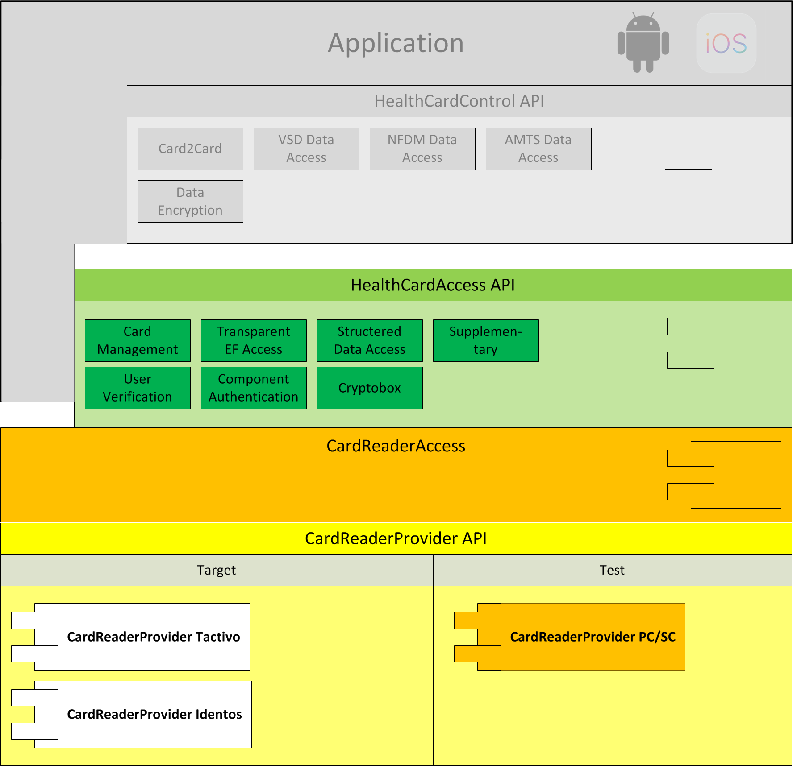

# HealthCardAccessKit

Low level framework for accessing smart cards of the telematic infrastructure.

## Introduction

This part describes the usage of low level HealthCardAccess API in order to send
commands to a health card connected to card reader.

See the <https://gematik.github.iGematik> GitHub IO\] page for a more general overview.

## API Documentation

Generated API docs are available at <https://gematik.github.io/ref-HealthCardAccessKit>.

## License

Licensed under the [Apache License, Version 2.0](https://www.apache.org/licenses/LICENSE-2.0).

## Overview

This library contains the classes for cards, commands, card file systems and error handling.

### HealthCardAccessKit API

The HealthCardAccessKit API Structure contains the `HealthCard` class representing all supported card types,
the `Commands` and `Responses` groups with all supported commands and responses for health cards,
the `CardObjects` group with the possible objects on a health cards
and the `Operation` group for cascading and executing commands on health cards.

#### Health Cards

The class `HealthCard` represents the potential types of health cards by storing a `HealthCardStatus` property which in
case of being *valid* by itself stores a `HealthCardPropertyType` which at the time of writing is represented by either
one of the following

-   egk ("elektronische Gesundheitskarte")

-   hba ("Heilberufeausweis")

-   smcb ("Security Module Card Typ B").

The `HealthCardPropertyType` by itself stores the `CardGeneration` (G1, G1P, G2, G2.1) as well.

Furthermore the `HealthCard` object contains the physical card from a card reader and the current card channel.

#### Commands

The `Commands` groups contains all available `HealthCardCommand` objects for health cards through the `HealthCardCommandBuilder`.

## Getting Started

HealthCardAccess requires Swift 5.1.

### Setup for integration

-   **Carthage:** Put this in your `Cartfile`:

        github "gematik/HealthCardAccessKit" ~> 1.0

### Setup for development

You will need [Bundler](https://bundler.io/), [XcodeGen](https://github.com/yonaskolb/XcodeGen)
and [fastlane](https://fastlane.tools) to conveniently use the established development environment.

1.  Update ruby gems necessary for build commands

        $ bundle install --path vendor/gems

2.  Checkout (and build) dependencies and generate the xcodeproject

        $ bundle exec fastlane setup

3.  Build the project

        $ bundle exec fastlane build_all [build_mac, build_ios]

## Code Samples

### Create a command

The design of this API follows the [command design pattern](https://en.wikipedia.org/wiki/Command_pattern)
as well as functional programming paradigm comparable to [ReactiveX](http://reactivex.io/).
Thus a command object of appropriate command class for the desired command to be sent has to be created
first. When creating the command it needs to be configured.

Following example shall send a SELECT command to a smart card
in order to read a certificate EF.C.CH.AUT.R2048 from the application ESIGN.

First we want to to create a `SelectCommand` object passing a `ApplicationIdentifier`. We use one of the predefined
helper functions by using `HealthCardCommand.Select`.

One could also use the `HealthCardCommandBuilder` to construct a customized `HealthCardCommand`
by setting the APDU-bytes manually.

    let eSign = EgkFileSystem.DF.ESIGN
    let selectEsignCommand = HealthCardCommand.Select.selectFile(with: eSign.aid)

### Setting an execution target

We execute the created command `CardType` instance which has been typically provided by a `CardReaderType`.

In the next example we use a `HealthCard` object representing an eGK (elektronische Gesundheitskarte)
as one kind of a `HealthCardType` implementing the `CardType` protocol.

    let cardReader: CardReaderType = HCATerminalTestCase.reader // initialize your CardReaderType instance
    let card = try cardReader.connect([:])!
    let healthCardStatus = HealthCardStatus.valid(cardType: .egk(generation: .g2))
    let eGk = try HealthCard(card: card, status: healthCardStatus)
    let exec: Executable<HealthCardResponseType> = selectEsignCommand.execute(on: eGk)

The result of the command execution can be validated against an expected `ResponseStatus`,
e.g. SUCCESS (0x9000).

    let execEvaluated: Executable<HealthCardResponseType> = exec.map { healthCardResponse in
        guard healthCardResponse.responseStatus == ResponseStatus.success else {
            throw HealthCard.Error.operational // throw a meaningful Error
        }
        return healthCardResponse
    }

### Create a Command Sequence

It is possible to chain further commands via the `flatMap` function
even in an inline manner for further execution:

    let readCertificate: Executable<HealthCardResponseType> = execEvaluated.flatMap { _ in
        let sfi = EgkFileSystem.EF.esignCChAutR2048.sfid!
        let read = try HealthCardCommand.Read.readFileCommand(with: sfi, ne: 0x076C - 1)
        return read.execute(on: eGk)
    }

### Process Execution result

When the whole command chain is set up we have the run (or schedule) it by an `ExecutorService`.

    readCertificate
            .run(on: Executor.trampoline)
            .on { event in
                event.fold(
                        onComplete: { healthCardResponse in
                            DLog("Got a certifcate")
                            guard let data = healthCardResponse.data else {
                                DLog("No certificate data")
                                throw HealthCard.Error.operational
                            }
                            // proceed with certificate data here, show success message on screen etc.
                        },
                        onCancelled: {
                            DLog("Cancelled")
                        },
                        onTimedOut: {
                            DLog("Timeout")
                        },
                        onError: { error in
                            DLog("Error: \(error.localizedDescription)")
                        })
            }
